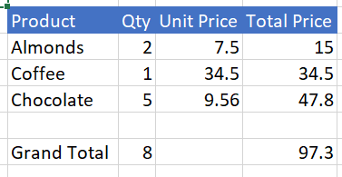

# Lesson 2: TypeScript


## TypeScript Exercise

Up to this point, you've used JavaScript to call the APIs only. You haven't
tried TypeScript yet. 

NOTE: If you don't know anything about TypeScript, it's OK! You can still follow along and even complete this lesson fairly easily. After all, it's still javascript and your knowledge still applies.

For more information and tutorials on TypeScript click on the following links:

* [TypeScript Tutorial - Tutorials Point](https://www.tutorialspoint.com/typescript/index.htm)
* [TypeScript Tutorial](https://www.typescriptlang.org/docs/handbook/typescript-in-5-minutes.html)
* [TypeScript Documenation](https://www.typescriptlang.org/docs/handbook/basic-types.html)

To prepare for this lesson, perform an exercise by making a simple modification to the code from Lesson 1. We will be converting the exercise from Lesson 1 from JavaScript to TypeScript.

2.0.1 Convert the ```return context.sync .then``` construct to the simpler and more readable ```async/await``` TypeScript construct.

Hints:
* A function must be declared with the ```async``` modifier if ```await``` is called inside.
* ```await``` replaces the ```return``` and ```.then``` wrapper around the completion code.
* All TypeScript types and libraries have already been included, check them out on the Libraries tab.
* If you are get stuck look at Lesson 2 answers or the **Basic API Call** under the Samples section.

**Note:** If you've already done this lesson on your own, congratulations! You can skip to step 2.0.2. Otherwise, keep following the steps.

2.0.11 Replace the run() function with the following:

```
async function run() {
    try {
 
        await Excel.run(async (context) => {
            var range = context.workbook.getSelectedRange();
            range.format.fill.color = "yellow";
            range.load(["address", "values"]);
            await context.sync()
            console.log("The range address was \"" + range.address + "\".");
            await populateRange(context, range);
        })
    }
     catch (error) {
            OfficeHelpers.UI.notify(error);
            OfficeHelpers.Utilities.log(error);
        }
}
```

2.0.12 Replace the populateRange() function with the following:

```
async function populateRange(context: Excel.RequestContext, range: Excel.Range) {
    console.log("populateRange: range is - ", range.address);
    var newValues = range.values;
    var counter = 1;
    for (var i = 0; i < newValues.length; i++) {
        for (var j = 0; j < newValues[i].length; j++) {
            newValues[i][j] = counter++;
        }
    }
    range.values = newValues;
 
    await context.sync()
            console.log("finished populating the matrix");
 
}
```


2.0.2 Make sure that the code runs successfully as it did in Lesson 1.

Now let's switch gears. Start with a new sample snippet and this time add some more realistic functionality.

## Setup

2.1 Navigate and open the sample called "Copy and multiply values".

Observation: You can see that this is a TypeScript example. Note the ```await/async``` pattern and how much more readable this is.

2.2 Refresh the content in the Run pane and click the **Add sample data** button to see data inserted into the sheet.

2.3 Switch to the Template tab to see the HTML that drives the UI.

Observation: "Add sample data" is a button element with id="setup" and this is hooked up with the click handler called setup().

2.4 Look at the HTML code and study what each button's function is. Back in the **Run** pane, try the one labeled, "Multiply values using for loop". Pretty straight forward, right?

Now add a new button and handler to create a Grand Total under the Total Price column. For this, use the sum formula.

2.5 Add another button with a label of "Grand Total".

2.6 Add code to total the Total Price column and put the result in E7 (below the last entry). Also add the label "Grand Total" in B7.
* This should be the result


Hints:

* Use [Excel Worksheets Functions](https://dev.office.com/reference/add-ins/excel/functions)
* Remember that the values array will index from 0, even though the Excel
addresses are 1 based.
* Use the ```workbook.functions.sum()``` method.

Notice that the ```sum()``` method returns programmatically the value of the sum of the range, which we add to a cell. However, typically, you'd add a formula like this: ``` =sum(<range>) ``` into that cell instead of the resulting value.

**Note**: if you succeeded in creating the Grand Total button and handler, go to step 2.7, otherwise continue.

2.6.1 Add the code for the button in the "Template" tab after the "Run code" button:

```
<button id="grand-total" class="ms-Button">
        <span class="ms-Button-label">Grand Total</span>
</button>
```

2.6.2 Now add the handler back in the "Script" tab at the end of the module:

```
async function grandTotal() {
    try {
        await Excel.run(async (ctx) => {
            var range = ctx.workbook.worksheets.getItem("Sample").getRange("E3:E5");
            var rangeTot = ctx.workbook.worksheets.getItem("Sample").getRange("B7:E8");
            var gTot = ctx.workbook.functions.sum(range);

            range.load("values");
            rangeTot.load("values");
            gTot.load();

            await ctx.sync();

            var vTot = rangeTot.values;

            console.log(gTot.value);
            console.log(range);
            vTot[0][3] = gTot.value;
            vTot[0][0] = "Grand Total";
            vTot[0][1] = "=sum(c3:c5)";

            rangeTot.values = vTot;

            await ctx.sync();
        });
    }
    catch (error) {
        OfficeHelpers.UI.notify(error);
        OfficeHelpers.Utilities.log(error);
    }
}
```

2.6.3 Now add the button click handler hook-up, just after the other multiply-values click handler hook-ups, at the top of the module:

```
$("#grand-total").click(grandTotal);
```

2.7 You will be using the range calculation API in Lesson 4, so let's add another value into the Grand Total row. This one should total up the Qty column but not use the ```workbook.functions.sum()``` method. Instead add the ```=sum()``` formula into the cell for later calculation.
* This should be the result


2.8 After this is successful, add another row with Tax (say B6:E6) and include that into the Grand Total amount.
